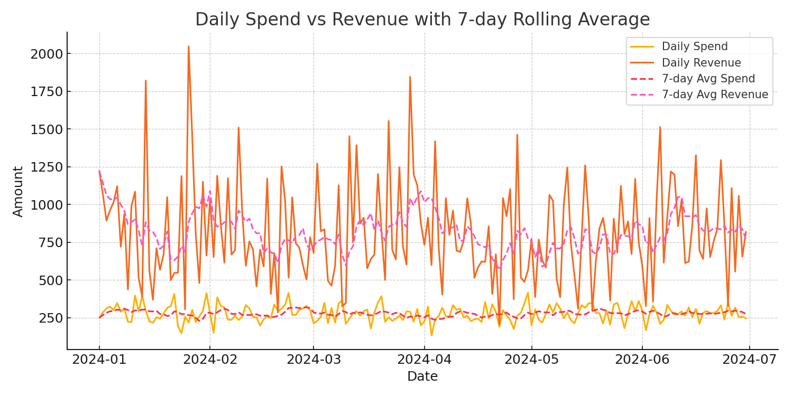

# E-commerce Campaign Performance Analysis

This repository contains chart images and insights from an end-to-end analysis of e-commerce marketing campaigns (synthetic data Jan–Jun 2024). Each section embeds a chart and provides commentary.

## Table of Contents
1. [Daily Spend vs. Revenue](#daily-spend-vs-revenue)
2. [Channel Performance Summary](#channel-performance-summary)
3. [ROI by Channel](#roi-by-channel)
4. [CTR & Conversion Rate by Channel](#ctr--conversion-rate-by-channel)
5. [CPA by Channel](#cpa-by-channel)
6. [Monthly Revenue by Channel](#monthly-revenue-by-channel)
7. [Monthly Spend by Channel (Stacked Area)](#monthly-spend-by-channel-stacked-area)
8. [Funnel Drop-Off by Channel](#funnel-drop-off-by-channel)
9. [Monthly ROI Heatmap by Channel](#monthly-roi-heatmap-by-channel)
10. [Additional Charts](#additional-charts)
    - [Cumulative Spend vs. Revenue](#cumulative-spend-vs-revenue)
    - [CTR vs. Conversion Rate Scatter](#ctr-vs-conversion-rate-scatter)
    - [Pareto Revenue by Channel](#pareto-revenue-by-channel)
11. [Key Recommendations](#key-recommendations)
12. [How to Reproduce (Optional)](#how-to-reproduce-optional)

## Daily Spend vs. Revenue


This chart shows daily total spend vs. revenue and 7-day averages. Observations:
- Revenue generally tracks spend, with fluctuations.
- Identify days where revenue < spend to optimize campaigns.
- 7-day average indicates overall positive ROI after mid-March.

## Channel Performance Summary


Summary of total impressions, clicks, conversions, spend, revenue, CTR, conversion rate, CPC, CPA, ROI per channel:
- **Email**: Very low spend and high ROI; scale email efforts.
- **Google Ads**: High spend, lower ROI; optimize keywords/landing pages.
- **Facebook Ads**: Moderate ROI; refine targeting and messaging.
- **Instagram**: Steady performance; consider budget increase and creative tests.
- **LinkedIn**: Higher CPC; ensure conversions justify spend.

## ROI by Channel


Bar chart of overall ROI per channel. Email leads; Google Ads trails. Allocate budget accordingly.

## CTR & Conversion Rate by Channel


Comparison of CTR and conversion rates:
- Channels with decent CTR but low conversion rate need landing page improvements.
- High conversion but low CTR channels may need increased impressions.

## CPA by Channel


Cost per acquisition by channel highlights efficiency. Email has lowest CPA; Google Ads highest.

## Monthly Revenue by Channel


Line chart showing revenue trends by channel each month. Look for spikes/dips to correlate with campaigns or seasonality.

## Monthly Spend by Channel (Stacked Area)


Stacked area reveals spend distribution changes. Correlate spend shifts with revenue performance.

## Funnel Drop-Off by Channel


Normalized funnel: shows drop from impressions to clicks to conversions. Identify stages needing improvement.

## Monthly ROI Heatmap by Channel


Heatmap displays ROI variability over months. Highlight months/channels with strong or weak ROI.

## Additional Charts
### Cumulative Spend vs. Revenue

Shows breakeven point and overall trajectory.

### CTR vs. Conversion Rate Scatter

Bubble chart: CTR vs. conversion rate, bubble size ~ spend. Identify channel efficiency.

### Pareto Revenue by Channel

Pareto analysis: top channels contributing majority of revenue.

## Key Recommendations
1. Scale email campaigns due to strong ROI.
2. Optimize Google Ads: keyword refinement, landing page tests.
3. Increase Instagram budget with A/B creative tests.
4. Evaluate LinkedIn spend relative to customer LTV.
5. Monitor daily revenue vs. spend in live dashboards.
6. Improve funnel stages for channels with high impressions but low conversions.
7. Leverage seasonality: schedule promotions when performance peaks.

## How to Reproduce (Optional)
1. Place or generate `data/ecommerce_campaign_data.csv` by running the script:
   ```bash
   python scripts/generate_synthetic_data.py
   ```
2. Run plotting script to regenerate images:
   ```bash
   python scripts/plot_charts.py
   ```
3. Images will be saved to `dashboards/`. Commit updated images if data or analysis changes.
